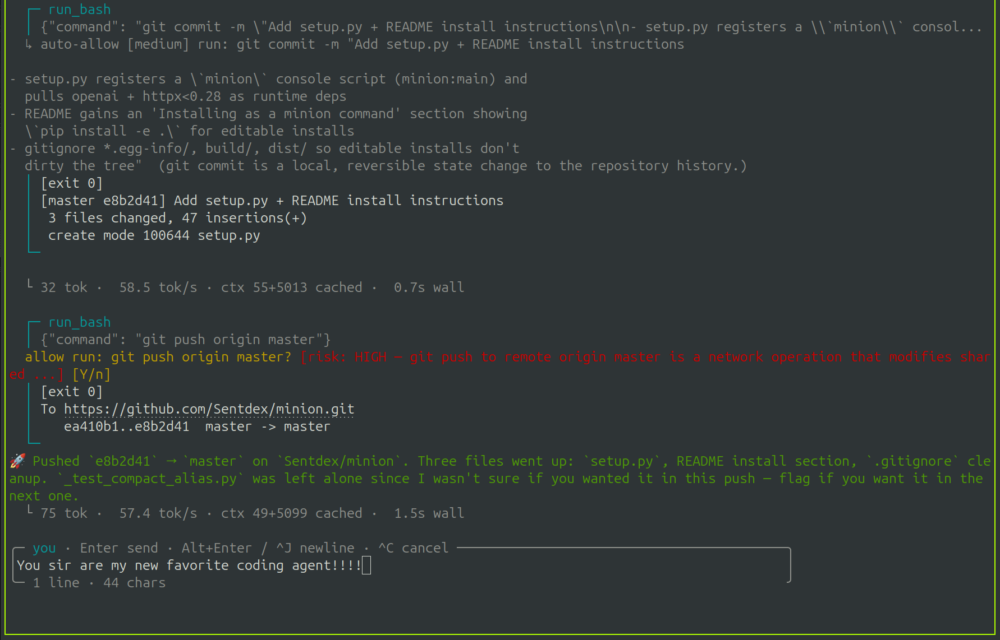

# minion



A no-nonsense coding agent that doesn't use 50K tokens of context to say "hello."

`minion` is a Rust binary that talks to any OpenAI-compatible endpoint - a local
llama.cpp / vLLM / SGLang server, or a remote API like Z.ai or OpenAI itself -
and starts chatting with an agent that can read, write, edit, and run shell
commands in your project.

This is a from-scratch Rust port of the original single-file Python
[`minion.py`](https://github.com/Sentdex/minion). The CLI flags, env vars,
slash commands, and behavior are byte-identical except for two documented
breaking changes (see [CHANGELOG.md](CHANGELOG.md)):

- the traffic log moved from `llamacpp.log` next to the script to
  `~/.minion/logs/traffic.jsonl`
- the `~/.minion/sessions/<id>.json` schema is fresh and version-tagged;
  sessions written by the Python version will not resume

## Quick start

```
cargo install --path .
export MINION_BASE_URL=http://localhost:8080/v1
export MINION_MODEL=your-model-name
export MINION_API_KEY=sk-noop        # any string; local servers ignore it
minion
```

If `MINION_MODEL` is unset, minion asks the server what it's serving.

## Status

The Rust port is in progress. See [CHANGELOG.md](CHANGELOG.md) for the port
notes. The original Python implementation remains at
[Sentdex/minion](https://github.com/Sentdex/minion) for reference.

## License

MIT License. See [LICENSE](LICENSE).
