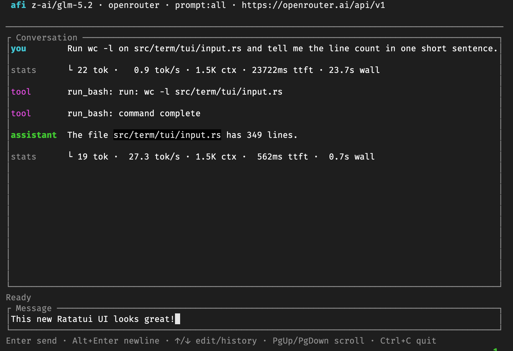

# afi



A no-nonsense coding agent that doesn't use 50K tokens of context to say "hello."

`afi` is a Rust binary that talks to any OpenAI-compatible endpoint - a local llama.cpp, vLLM, or SGLang server, or a remote API like Z.ai or OpenAI - and gives you an agent that reads, writes, edits, and runs shell commands in your project.

## Install

### Ubuntu and Debian

```
curl -1sLf 'https://dl.cloudsmith.io/public/smykla-skalski/afi/setup.deb.sh' | sudo -E bash
sudo apt-get install afi
```

The setup script adds the signing key and the apt source, after which upgrades
arrive through `apt-get upgrade` like any other package. The package holds a
static binary and declares no dependencies, so it installs on any Debian
derivative regardless of glibc version. amd64 and arm64 are both published.

### macOS and other Linux

```
curl -fsSL https://raw.githubusercontent.com/smykla-skalski/afi/main/scripts/install.sh | sh
```

Works out your platform, checks the published sha256, and installs to
`~/.local/bin` (or `/usr/local/bin` as root). Set `AFI_VERSION` to pin a version
and `AFI_BIN_DIR` to install somewhere else. When the GitHub CLI is on your PATH
the script also verifies the release's build provenance.

### From crates.io

```
cargo install afi-cli --locked
```

The crate is `afi-cli` because `afi` on crates.io belongs to an unrelated
audio/video crate from 2017. The binary it installs is `afi`.

### Prebuilt binary

Every release attaches an archive and a checksum per target to the
[releases page](https://github.com/smykla-skalski/afi/releases): static musl
builds for Linux on x86_64 and aarch64, a glibc build for x86_64 Linux, and
macOS on both architectures.

### From source

```
cargo install --path .
```

### Checking what you downloaded

Every archive and package carries a Sigstore build-provenance attestation, so
you can check it was produced by this repository's release workflow:

```
gh attestation verify afi-x86_64-unknown-linux-musl.tar.gz --repo smykla-skalski/afi
```

The `.sha256` files are uploaded alongside the archives by the same job, so they
tell you a download arrived intact and nothing about where it came from. The
attestation is the one that answers that.

### Which build is this

```
afi --version
```

Prints the version, the commit it was built from, the target triple, and the sha256 of the executable itself, so a binary can be identified from a CI log. See [version and build metadata](docs/reference.md#version-and-build-metadata).

## Quick start

```
export AFI_BASE_URL=http://localhost:8080/v1
export AFI_MODEL=your-model-name
export AFI_API_KEY=sk-noop        # any string - local servers ignore it
afi
```

If `AFI_MODEL` is unset, afi asks the server what it's serving.

## Configuration

afi reads configuration from environment variables and loads `~/.env` automatically at startup, so you don't need to export variables in every terminal.

### Single source (simple)

```
AFI_BASE_URL=http://localhost:8080/v1
AFI_MODEL=your-model-name
AFI_API_KEY=sk-noop
```

### Multiple sources

Define named endpoints and switch between them at runtime:

```
AFI_SOURCES=local,zai

AFI_SOURCE_LOCAL_BASE_URL=http://localhost:8080/v1
AFI_SOURCE_LOCAL_API_KEY=sk-noop

AFI_SOURCE_ZAI_BASE_URL=https://api.z.ai/api/paas/v4
AFI_SOURCE_ZAI_API_KEY=$zai_test         # $name = look up a key from env / ~/.env
AFI_SOURCE_ZAI_MODEL=glm-x-preview
```

See [`sources.example.env`](sources.example.env) for a full annotated example.
Switch at runtime with `/source [name]`.

## Reference

Flags, environment variables, subcommands, and slash commands: see [docs/reference.md](docs/reference.md).

How a version gets built, published, and undone: see [docs/releasing.md](docs/releasing.md).

## Terminal interfaces

When stdin and stdout are terminals, afi runs one persistent fullscreen Ratatui interface. The header, Markdown conversation, activity indicator, multiline composer, footer, and approval dialog share one layout and one input loop.

- **Enter** submits. **Alt+Enter** or **Ctrl+J** inserts a newline.
- **Paste** preserves indentation, blank lines, and trailing newlines across LF, CRLF, and CR line endings. The composer grows to five visible rows, then scrolls internally with a scrollbar.
- **Up/Down** moves through multiline or wrapped input, then traverses prompt history at the boundary. Moving past the newest entry restores the unfinished draft. **Alt+Up/Down** traverses history directly.
- **PageUp/PageDown** or the **mouse wheel** scrolls the conversation or an open approval dialog. The conversation and overflowing composer each show their current position with a scrollbar.
- **Esc** or **Ctrl+C** cancels active work. **Ctrl+C** exits while idle.
- **Y** approves a requested action. **N**, **Enter**, or **Esc** denies or cancels it.
- Approval requests dim the inactive interface and use an opaque, high-contrast dialog. Long prompts show a scrollbar.

When either stream is not a terminal, afi falls back to a plain line-oriented interface. It emits no terminal control sequences or prompts to redirected stdout, and denies non-interactive approval requests by default. `--prompt-file <path>` and `--prompt-file -` always use this plain interface.

## Sessions (save / resume)

afi saves every chat automatically to `~/.afi/sessions/` (override with `AFI_HOME` or `AFI_SESSIONS_DIR`): one JSON file per session, holding the exact message array the model sees plus metadata (id, title, description, source, cwd, timestamps). Files are plain JSON, human-readable, and greppable.

- **Auto-save** happens after every model turn
- The **title** is auto-derived from your first message. Set a custom one with `/save <title>`
- A **short id** (the 6-hex suffix) is shown in listings and accepted by `--resume` / `/resume`
- **Resume** a session at startup with `afi --resume <target>` or mid-chat with `/resume <target>`

## Tools

| tool        | args                  | notes                           |
| ----------- | --------------------- | ------------------------------- |
| `read_file` | `path`                |                                 |
| `write_file`| `path`, `content`     | overwrites, requires confirmation |
| `edit_file` | `path`, `old`, `new`  | `old` must match exactly once   |
| `list_dir`  | `path`                |                                 |
| `run_bash`  | `command`             | requires confirmation           |
| `wait_background` | `pid`          | wait for a backgrounded command |

`--read-only` denies every tool that can change anything, which is the posture a CI job wants: it needs no approval bypass, because the tools approval asks about are the ones it removes. `--allowed-tools` and `--disallowed-tools` bound the set more precisely. Approval decides whether afi asks; these decide what exists to ask about. See [tool policy](docs/reference.md#tool-policy).

## Credits

Inspired by [`minion.py`](https://github.com/Sentdex/minion), Sentdex's single-file Python coding agent.

## Package hosting

[](https://cloudsmith.com)

Package repository hosting is graciously provided by [Cloudsmith](https://cloudsmith.com). The apt repository runs on their open-source plan, free of charge.

## License

MIT License. See [LICENSE](LICENSE).
